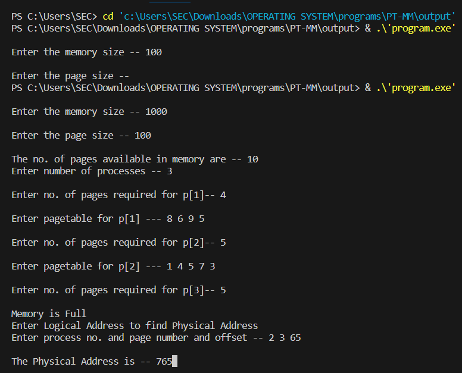

# EX.9 IMPLEMENTATION OF PAGING MEMORY MANAGEMENT
## AIM:
  To write a c program to implement Paging technique for memory management.
## ALGORITHM:

  1. Read all the necessary input from the keyboard.
  2. Pages - Logical memory is broken into fixed - sized blocks.
  3. Frames – Physical memory is broken into fixed – sized blocks.
  4. Calculate the physical address using the logical address
  5. Physical address = (Frame number * Frame size) + offset
  6. Display the physical address.
  7. Stop the process
## PROGRAM:
```c
#include<stdio.h>
#include<conio.h>
int main()
{
int ms, ps, nop, np, rempages, i, j, x, y, pa, offset;
int s[10], fno[10][20];
printf("\nEnter the memory size -- ");
scanf("%d",&ms);
printf("\nEnter the page size -- ");
scanf("%d",&ps);
nop = ms/ps;
printf("\nThe no. of pages available in memory are -- %d ",nop);
printf("\nEnter number of processes -- ");
scanf("%d",&np);
rempages = nop;
for(i=1;i<=np;i++)
{
printf("\nEnter no. of pages required for p[%d]-- ",i);
scanf("%d",&s[i]);
if(s[i] >rempages)
{
printf("\nMemory is Full");
break;
}
rempages = rempages - s[i];
printf("\nEnter pagetable for p[%d] --- ",i);
for(j=0;j<s[i];j++)
scanf("%d",&fno[i][j]);
}
printf("\nEnter Logical Address to find Physical Address ");
printf("\nEnter process no. and page number and offset -- ");
scanf("%d %d %d",&x,&y, &offset);
if(x>np || y>=s[i] || offset>=ps)
printf("\nInvalid Process or Page Number or offset");
else
{ pa=fno[x][y]*ps+offset;
printf("\nThe Physical Address is -- %d",pa);
}
getch();
}
```
## OUTPUT:



## RESULT:
  Thus the implementation of paging technique for memory management is executed successfully.